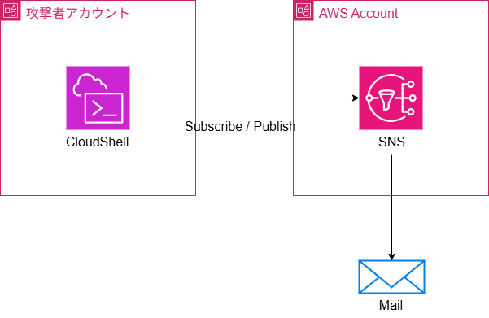

# Public SNS Topic with Access Policy

AWS CDKを使用してパブリックアクセス可能なSNSトピックを作成するプロジェクトです。

## ⚠️ 注意事項

このSNSトピックは**パブリックアクセスポリシー**を持っています。
- 任意のAWSアカウントからPublish/Subscribeが可能です
- 本番環境での使用には十分注意してください
- 必要に応じてアクセス制限を追加することを推奨します

## アーキテクチャ



## デプロイ

```bash
git clone https://github.com/kyo-tsun/public_sns.git
cd public_sns
npm install
npm run build
npx cdk bootstrap
npx cdk deploy
```
